# Diagrammes — Mini-Cloud Pédagogique ISSAT Mahdia

> Tous les diagrammes sont au format [Mermaid](https://mermaid.js.org/) et s'affichent automatiquement sur GitHub.
> **Les adresses IP sont fictives** — elles servent uniquement d'illustration (`10.0.x.x` / `10.1.x.x`).

---

## Table des matières

1. [Diagramme de Gantt](#1-diagramme-de-gantt)
2. [Architecture réseau globale](#2-architecture-réseau-globale)
3. [Architecture des réseaux Docker](#3-architecture-des-réseaux-docker)
4. [VM vs Conteneurs Docker](#4-vm-vs-conteneurs-docker)
5. [Cas d'utilisation — Général](#5-cas-dutilisation--général)
6. [Cas d'utilisation — Étudiant](#6-cas-dutilisation--étudiant)
7. [Cas d'utilisation — Enseignant](#7-cas-dutilisation--enseignant)
8. [Cas d'utilisation — Administrateur](#8-cas-dutilisation--administrateur)
9. [Diagramme de séquence — Session étudiant](#9-diagramme-de-séquence--flux-complet-session-étudiant)
10. [Hiérarchie des images Docker](#10-hiérarchie-des-images-docker)
11. [Organigramme — lancer\_issat.sh](#11-organigramme--lancer_issatsh)
12. [Flux de soumission — n8n](#12-flux-de-soumission--n8n)

---

## 1. Diagramme de Gantt

> Période : **06 Février 2026 → 20 Mai 2026** — 8 sprints Scrum — durée totale : 15 semaines

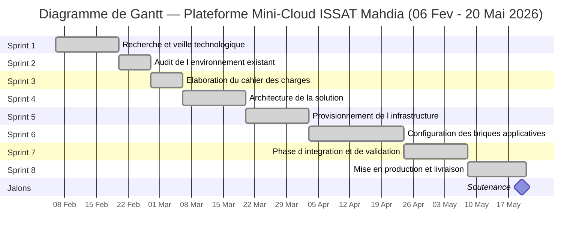

---

## 2. Architecture réseau globale

> **IPs fictives** : réseau ISSAT `10.0.0.0/24` · réseau laboratoire privé `10.1.0.0/24`

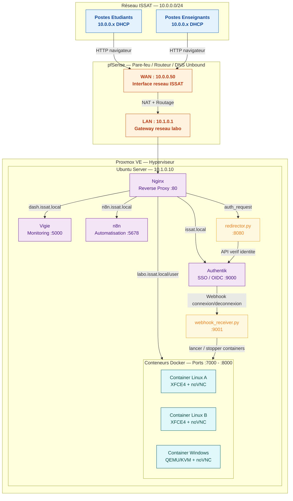

---

## 3. Architecture des réseaux Docker

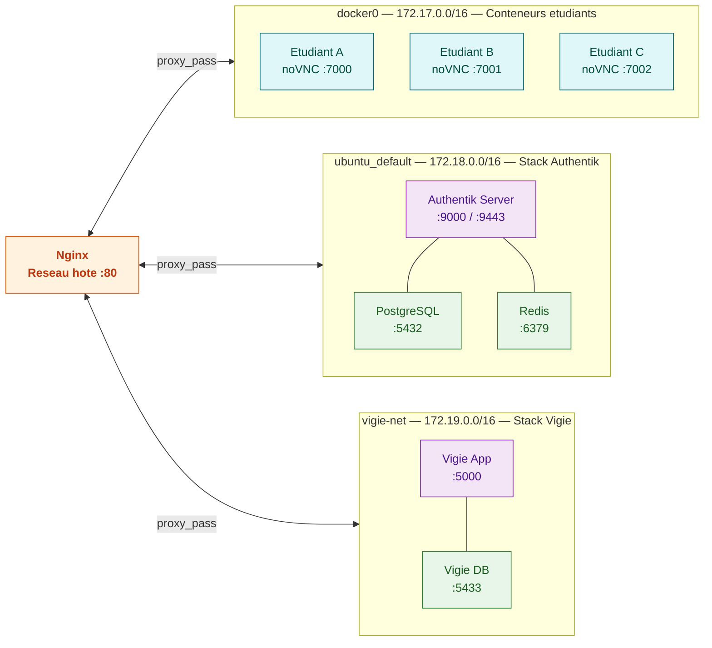

---

## 4. VM vs Conteneurs Docker

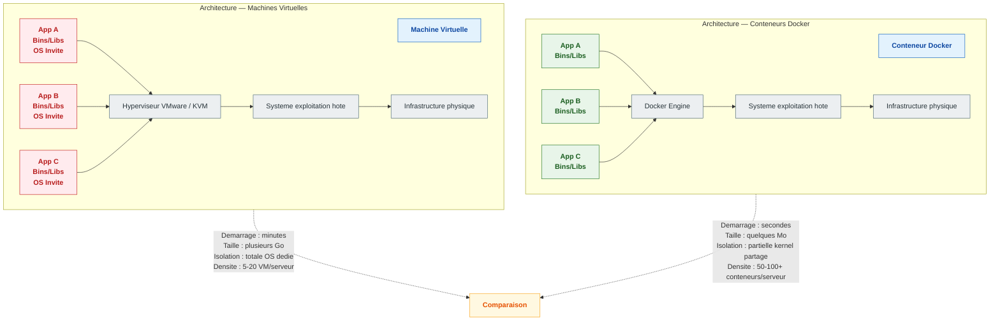

---

## 5. Cas d'utilisation — Général

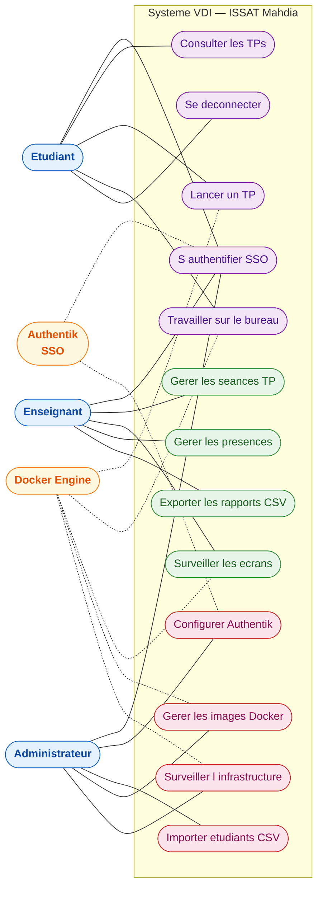

---

## 6. Cas d'utilisation — Étudiant

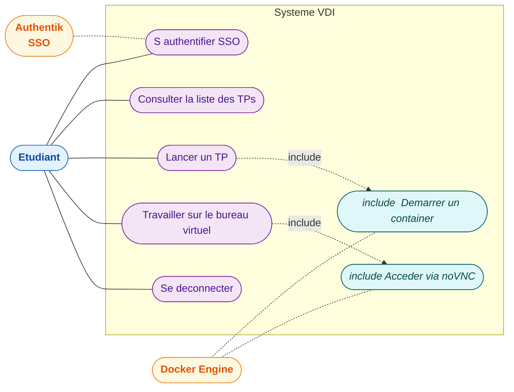

---

## 7. Cas d'utilisation — Enseignant

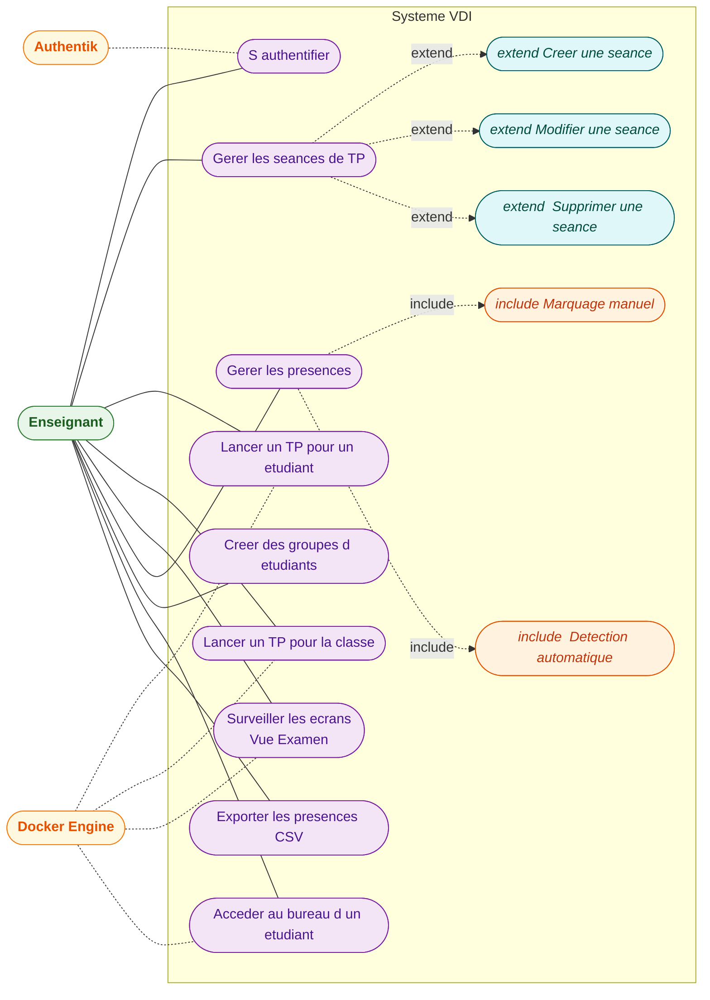

---

## 8. Cas d'utilisation — Administrateur

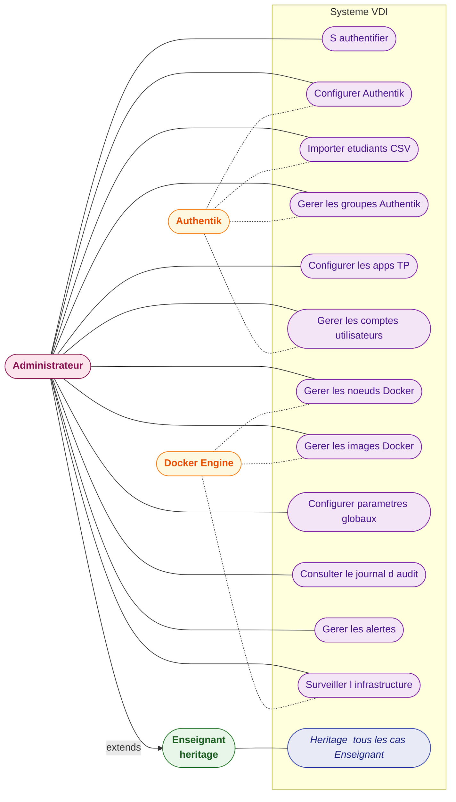

---

## 9. Diagramme de séquence — Flux complet session étudiant

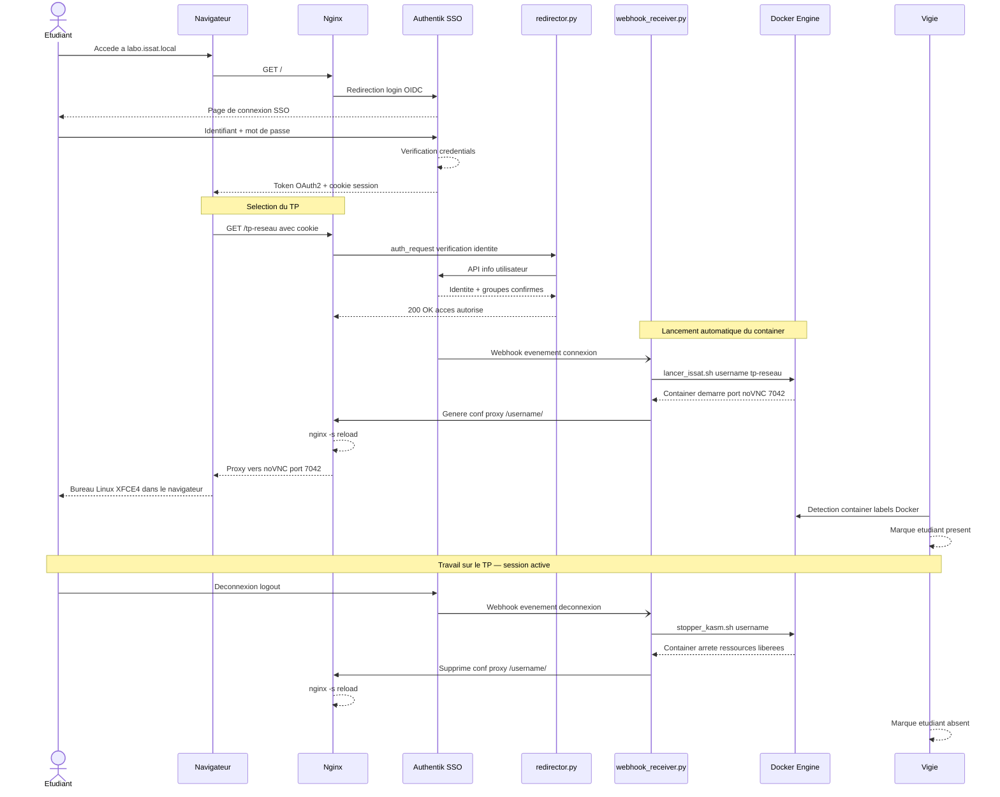

---

## 10. Hiérarchie des images Docker

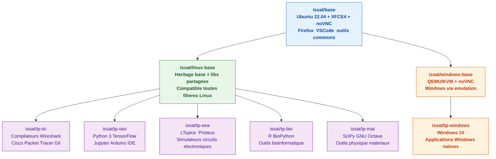

---

## 11. Organigramme — lancer_issat.sh

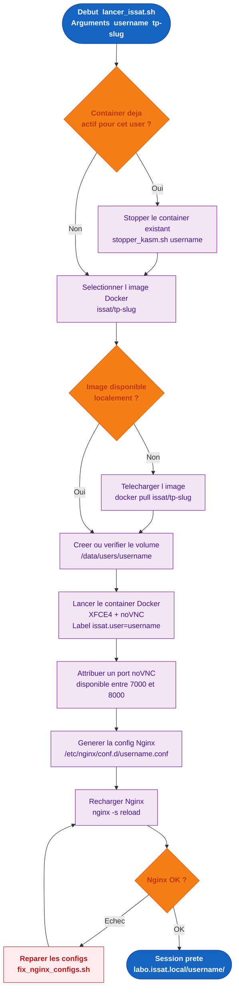

---

## 12. Flux de soumission — n8n

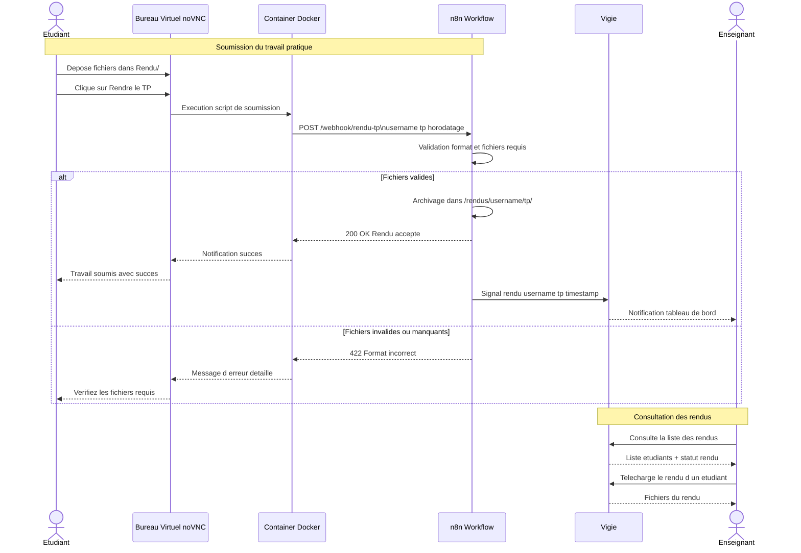
